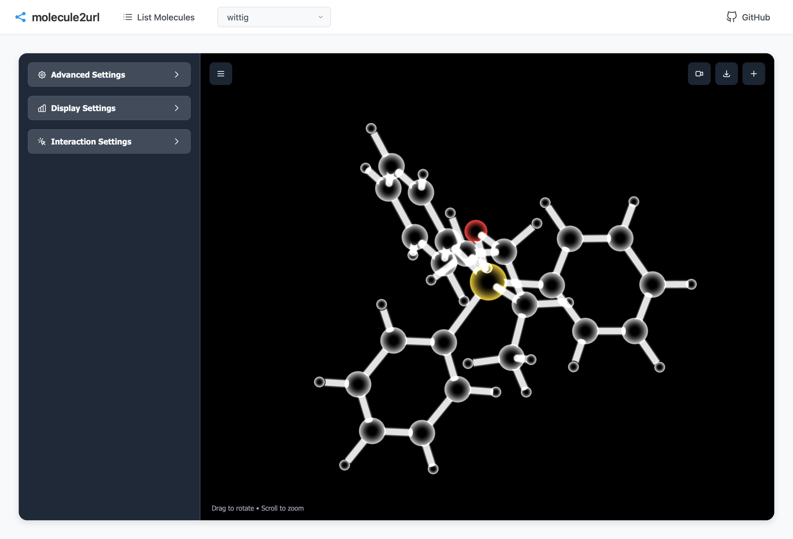
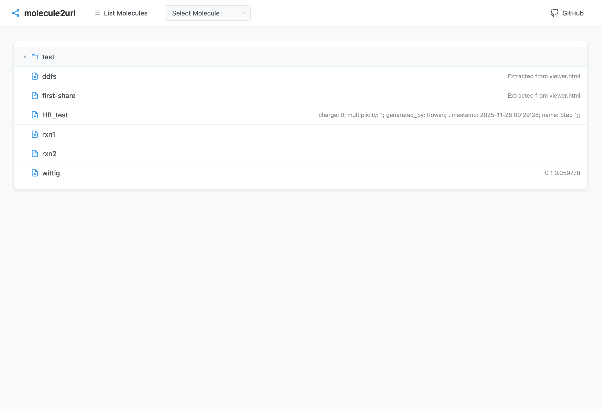
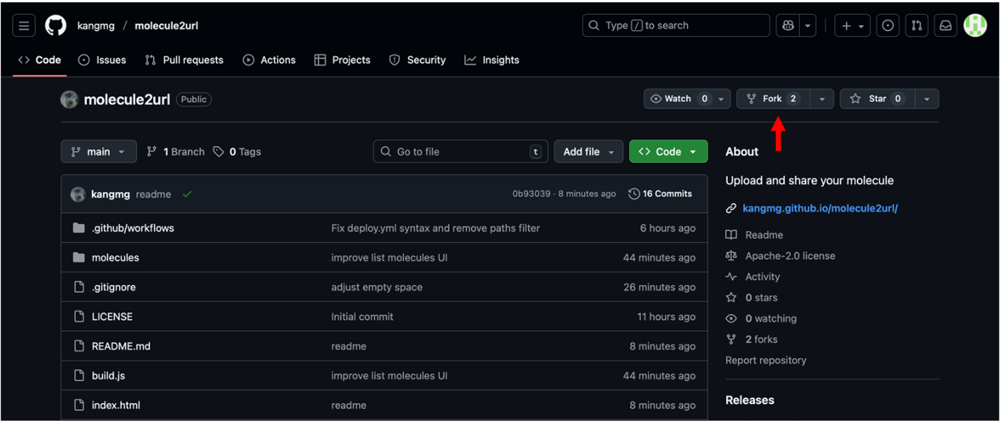
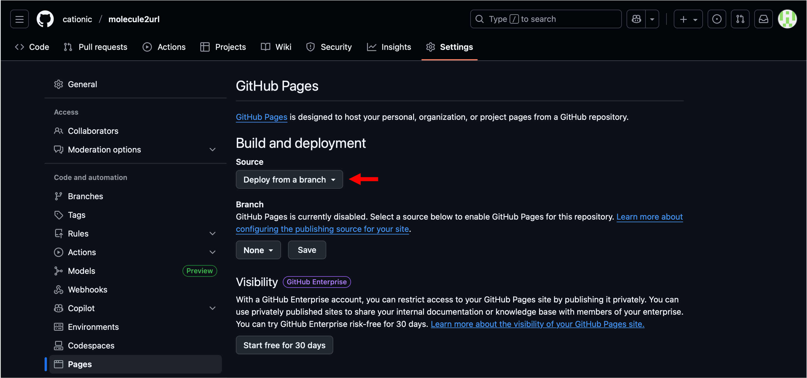
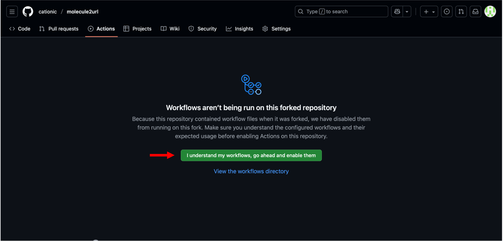
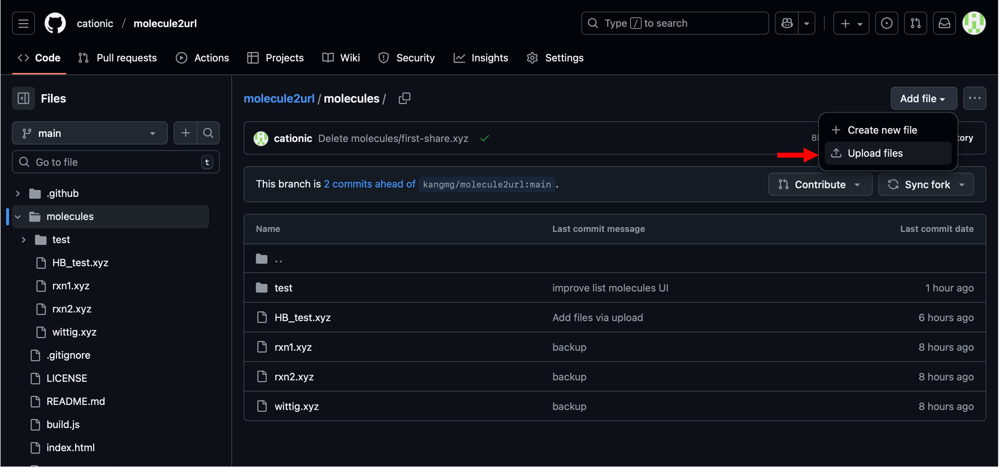
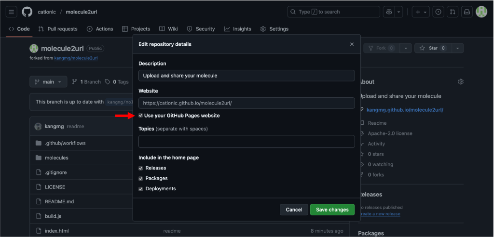

# molecule2url
**Share your molecules simply via URL.**

<table align="center">
  <tr>
    <td align="center" width="50%">
      
       
      <b>Main Viewer</b>
    </td>
    <td align="center" width="50%">
      
       
      <b>Molecule List</b>
    </td>
  </tr>
</table>

## Usage

### 1. Deployment (How to host your own)
You can easily host your own instance of this viewer using GitHub Pages.

<ol>
  <li>
    <b>Fork the Repository</b>
     
    Start by forking <code>github.com/kangmg/molecule2url</code> to your own GitHub account.
    

      
    

  </li>
   
  <li>
    <b>Configure Deployment Source</b>
     
    Navigate to <i>Settings > Pages > Build and deployment</i> and change the <b>Source</b> to <b>GitHub Actions</b>.
    

      
    

  </li>
   
  <li>
    <b>Enable Workflows</b>
     
    Go to the <b>Actions</b> tab. Click the green button labeled "<b>I understand my workflows, go ahead and enable them</b>".
    

      
    

  </li>
   
  <li>
    <b>Trigger Deployment</b>
     
    The site deploys automatically on every push. To start, upload or remove the xyz files in <code>/molecules/*.xyz</code>.
    

      
    

  </li>
   
  <li>
    <b>Display Deployment URL</b>
     
    Mark the checkbox. This makes your live URL visible on the repository homepage.
    

      
    

  </li>
   
  <li>
    <b>Done!</b>
     
    Your personal molecule viewer is now live and ready to share. 
     
    (<code>https://&lt;your-username&gt;.github.io/molecule2url/</code>)
  </li>
</ol>

### 2. Adding Molecules
Upload your `.xyz` files (single or multi-frame) into the `molecules` folder.

> The **comment line** (2nd line of the file) will be automatically used as the description.
